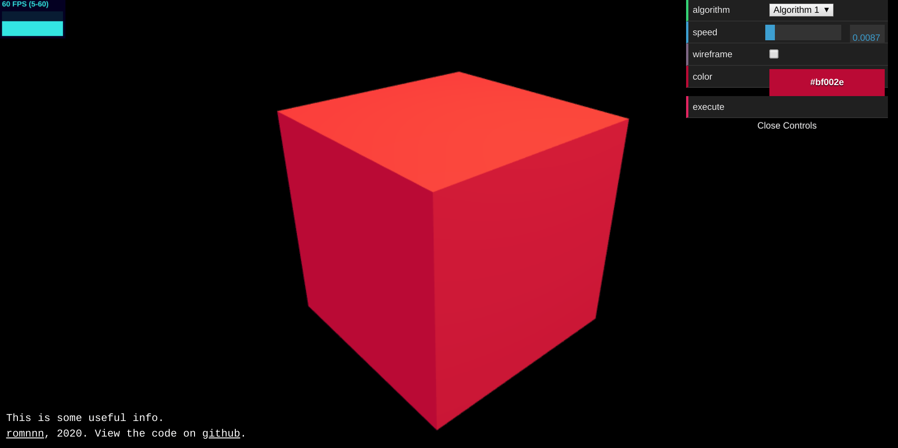

.. highlight:: console

===============================
Cookiecutter WebGL Template
===============================

.. image:: https://travis-ci.com/romnn/cookiecutter-webgl.svg?branch=master
    :target: https://travis-ci.com/romnn/cookiecutter-webgl
    :alt: Build status

This ``cookiecutter`` templates a modern base project for
creating ``WebGL`` experiments with `three.js`_.

It uses yarn_ and typescript_ with webpack_ and also includes
common tools such as `dat.gui`_, `stats.js`_ or `Orbit Controls`_.

See the generated template `in action <https://romnn.github.io/cookiecutter-webgl/>`_. 

.. _three.js: https://threejs.org/
.. _yarn: https://yarnpkg.com/
.. _typescript: https://www.typescriptlang.org/
.. _webpack: https://webpack.js.org/
.. _dat.gui: https://github.com/dataarts/dat.gui
.. _stats.js: https://github.com/mrdoob/stats.js/
.. _Orbit Controls: https://threejs.org/docs/#examples/en/controls/OrbitControls

Features
--------

* Modern typescript_ ECMA 2018 code base
* Fully typed support for three.js_
* Bundling using webpack_
* Pre configured to import your CSS and transpile `SASS/SCSS`_
* Includes bootstrap_ for quick prototype user interfaces
* Includes useful tools: `dat.gui`_, `stats.js`_ and `Orbit Controls`_
* Fast and deterministic dependencies using yarn_
* Hot reload (HMR) development mode
* Integrated linting and auto-fixing using eslint_
* Optional linting as a git pre commit hook

.. _`SASS/SCSS`: https://sass-lang.com/
.. _`eslint`: https://eslint.org/
.. _`bootstrap`: https://getbootstrap.com/

Quickstart
----------

Install ``cookiecutter>=1.4.0`` if you haven't already::

    $ python3 -m pip install -U cookiecutter

Generate your WebGL project (you will be asked for the project name etc)::

    $ cookiecutter https://github.com/romnn/cookiecutter-webgl.git

After your project was created:

* Create a remote repository and publish your project::

    $ cd <mypackage>
    $ git remote add origin git@github.com:myusername/mypackage.git
    $ git add .
    $ git commit -m "Initial commit"
    $ git push --set-upstream origin master

* Add the repo to your `Travis-CI`_ account.
  If you have connected travis with GitHub this is done automatically.

* If you wish to publish an interactive demo version of your project on `GitHub Pages`_,
  `generate a GitHub access token <https://github.com/settings/tokens>`_ for
  `repo:public_repo` and set this token in your travis build settings
  as a secret environment variable ``GH_TOKEN``.

  If you do not want to deploy to `GitHub Pages`_,
  remove the ``deploy pages`` build stage from ``.travis.yml``.

* From here on you can continue with the instructions in
  your generated project's ``README.md``.

* Start coding!

.. _Travis-CI: https://travis-ci.com
.. _GitHub Pages: https://pages.github.com/

Customization after project creation
-------------------------------------

    How can I add git pre commit checks to a project when I disabled
    them during creation?

The template still installs husky_,
the package used for installing git hooks in your project,
but does not configure any rules. Just add an entry to your ``package.json``:

.. code-block:: json

    "husky": {
        "hooks": {
            "pre-commit": "yarn lint"
        }
    }

.. _husky: https://github.com/typicode/husky

    How can I change the linter strictness about warnings
    after I created the project?

You can always configure the ``.eslintrc.js`` and ``.prettierrc.js``
as you desire.
To change how linting warnings are treated, change the ``--max-warnings``
parameter value in your ``package.json``:

* ``--max-warnings=-1`` allows unlimited warnings
* ``--max-warnings=n`` where ``n>=0`` makes the linter
  fail after ``n`` warnings

Credits
-------------

* The basic setup structure was inspired by
  `mterczynski/typescript-webpack-threejs-template`_.

* The use and configuration of tools such as
  `dat.gui`_ or `stats.js`_ was inspired by
  `vaneenige/webgl-structure`_.

* The overall template structure including tests and hooks
  was inspired by my `python package template`_.

.. _`mterczynski/typescript-webpack-threejs-template`: https://github.com/mterczynski/typescript-webpack-threejs-template
.. _`vaneenige/webgl-structure`: https://github.com/vaneenige/webgl-structure
.. _`python package template`: https://github.com/romnn/cookiecutter-pypackage
